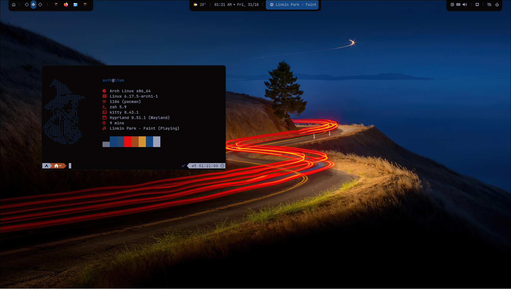
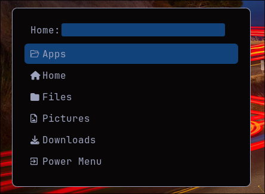
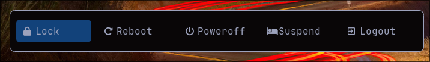

<p align="center">
<a href="https://git.io/typing-svg">

</a>
<br/>


</p>

---

> [!WARNING]
> This repository is a **work in progress**.
> Some modules may change, be deprecated, or require additional dependencies.

---

## Overview

**Caelum** is a curated collection of configuration files designed for a cohesive, minimal, and adaptive Wayland environment using **Hyprland**.
It integrates dynamic theming through **pywal**, modular **Neovim** configuration, and a clean **Waybar** layout.

---

## Structure

```
.
├── etc/
│   ├── fuzzel/
│   ├── kitty/
│   ├── nvim/
│   ├── rofi/
│   ├── swaync/
│   ├── waybar/
│   └── wofi/
├── hypr/
├── scripts/
├── wallpapers/
└── showcase/
```

---

## Components

| Component                | Path                                 | Description                                  |
| ------------------------ | ------------------------------------ | -------------------------------------------- |
| **Hyprland**             | `hypr/`                              | Window manager configuration and rules       |
| **Waybar**               | `etc/waybar/`                        | Status bar configuration with system scripts |
| **Neovim**               | `etc/nvim/`                          | Lua-based modular setup using lazy.nvim      |
| **Rofi / Wofi / Fuzzel** | `etc/rofi`, `etc/wofi`, `etc/fuzzel` | App launchers and menus                      |
| **Kitty**                | `etc/kitty/`                         | Terminal configuration                       |
| **SwayNC**               | `etc/swaync/`                        | Notification styling                         |
| **Scripts**              | `scripts/`                           | Utility scripts for system and theming       |
| **Wallpapers**           | `wallpapers/`                        | Wallpaper collection used by pywal           |
| **Showcase**             | `showcase/`                          | Desktop previews                             |

---

## Gallery

| Desktop              | Menu                        | Power                        |
| -------------------- | --------------------------- | ---------------------------- |
|  |  |  |

---

## Installation

Clone and install:

```bash
git clone https://github.com/yourname/caelum.git ~/caelum
cd ~/caelum
./install.sh
```

This will:

* Symlink configs into `~/.config/`
* Link scripts into `~/.local/bin/`
* Copy wallpapers into `~/Pictures/wallpapers/`

---

## Requirements

* **Hyprland**
* **Waybar**
* **Neovim (>=0.9)**
* **pywal**
* **swaync**
* **Kitty**
* **Rofi / Wofi / Fuzzel**

Optional:

* `playerctl`
* `pamixer`
* `brightnessctl`
* `jq`

---

## License

Licensed under the **MIT License**.
You are free to use, modify, and redistribute this configuration.

